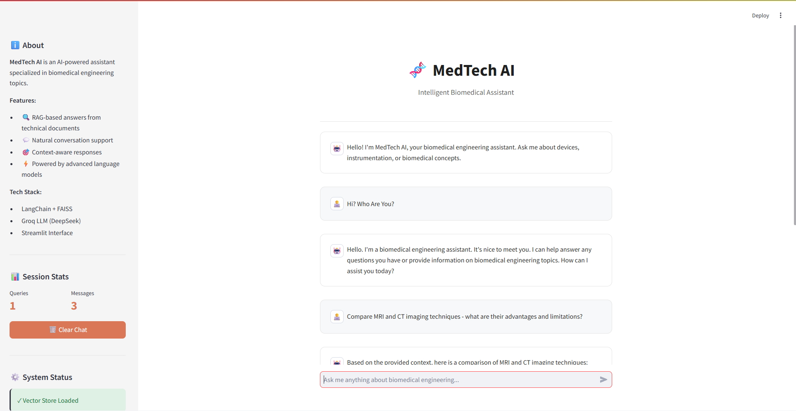

# 🔬 MedTech AI - Intelligent Biomedical Assistant

[](https://www.python.org/downloads/) [](https://streamlit.io) [](https://langchain.com) [](LICENSE)

> A production-ready, RAG-powered chatbot specialized in biomedical engineering topics. Built with LangChain, FAISS, and Groq LLM for intelligent document-based question answering.



## 📋 Table of Contents

- [🌟 Key Features](#-key-features)
- [🏗️ System Architecture](#️-system-architecture)
- [🚀 Quick Start](#-quick-start)
- [📁 Project Structure](#-project-structure)
- [🐳 Docker Deployment](#-docker-deployment)
- [🧪 Testing](#-testing)
- [📝 Configuration](#-configuration)
- [🎯 Usage Examples](#-usage-examples)
- [🔧 Troubleshooting](#-troubleshooting)
- [📊 Performance Metrics](#-performance-metrics)
- [🛠️ Technology Stack](#️-technology-stack)

## 🌟 Key Features

- **🧠 RAG Architecture**: Retrieval-Augmented Generation for accurate, context-based responses
- **📚 Document Processing**: Automatic PDF processing with OCR fallback
- **💬 Dual Mode Operation**: Technical Q&A + casual conversation support
- **🚀 Production Ready**: Proper error handling, logging, and monitoring
- **🐳 Docker Support**: One-command deployment with Docker Compose
- **✅ Tested**: Unit tests with pytest
- **📊 Session Management**: Track queries and conversation history

## 🏗️ Architecture

```

┌─────────────┐
│   User UI   │  (Streamlit)
└──────┬──────┘
│
┌──────▼──────────────┐
│   QA Chain Manager  │
│  (LangChain + Groq) │
└──────┬──────────────┘
│
┌──────▼──────────────┐
│ Vector Store (FAISS)│
│   + Embeddings      │
└──────┬──────────────┘
│
┌──────▼──────────────┐
│  PDF Documents      │
│  (Technical Docs)   │
└─────────────────────┘

```

## 📁 Project Structure

```

MedTech AI/
├── app.py                      # Main Streamlit application
├── main.py                     # Alternative application entry point
├── config.py                   # Centralized configuration
├── requirements.txt            # Python dependencies
├── Dockerfile                  # Docker container setup
├── docker-compose.yml          # Docker Compose configuration
├── uv.lock                     # Dependency lock file
├── .python-version             # Python version specification
├── view.png                    # Project view image
│
├── core/                       # Core functionality modules
│   ├── __init__.py
│   ├── vectorstore.py         # FAISS vector store management
│   ├── qa_chain.py            # QA chain operations
│   └── document_processor.py   # PDF processing & chunking
│
├── utils/                      # Utility modules
│   ├── __init__.py
│   └── logger.py              # Logging configuration
│
├── scripts/                    # Utility scripts
│   ├── __init__.py
│   └── build_vectorstore.py   # Index documents script
│
├── tests/                      # Unit tests
│   ├── __init__.py
│   └── test_qa.py             # Test suite
│
├── data/                       # PDF documents (add your files here)
├── vectorstore/                # FAISS index storage
│   └── db_faiss/
├── logs/                       # Application logs
│
├── .env.example               # Environment variables template
├── .gitignore                 # Git ignore rules
├── .gitattributes             # Git attributes
├── LICENSE                    # MIT License
└── README.md                  # This file

```

## 🚀 Quick Start

### Prerequisites

- Python 3.13+
- Groq API Key ([Get one free](https://console.groq.com))
- PDF documents for your knowledge base

### Installation

1. **Clone the repository**
```cmd
git clone https://github.com/beastNico/MedTech-AI.git
cd MedTech-AI
```

2. **Create virtual environment**

```cmd
python -m venv venv
venv\Scripts\activate
```

3. **Install dependencies**

```cmd
pip install -r requirements.txt
```

4. **Set up environment variables**

```cmd
copy .env.example .env
# Edit .env and add your GROQ_API_KEY
```

5. **Add your PDF documents**

```cmd
# Place PDF files in the data/ directory
copy your_documents.pdf data\
```

6. **Build vector store**

```cmd
python scripts\build_vectorstore.py
```

7. **Run the application**

```cmd
streamlit run app.py
```

Visit `http://localhost:8501` in your browser!

## 🐳 Docker Deployment

### Using Docker Compose (Recommended)

```cmd
# Build and run
docker-compose up -d

# View logs
docker-compose logs -f

# Stop
docker-compose down
```

### Using Docker directly

```cmd
# Build image
docker build -t medtech-ai .

# Run container
docker run -p 8501:8501 ^
  -v %cd%/data:/app/data ^
  -v %cd%/vectorstore:/app/vectorstore ^
  -e GROQ_API_KEY=your_key_here ^
  medtech-ai
```

## 🧪 Testing

Run tests with pytest:

```cmd
# Run all tests
pytest

# Run with coverage
pytest --cov=core --cov=utils

# Run specific test file
pytest tests\test_qa.py -v
```

## 📝 Configuration

Edit `config.py` to customize:

```python
# Model settings
LLM_MODEL = "deepseek-r1-distill-llama-70b"  # Change model
LLM_TEMPERATURE = 0.0                         # Adjust creativity

# Retrieval settings
RETRIEVAL_K = 6                               # Number of docs to retrieve
CHUNK_SIZE = 500                              # Text chunk size
CHUNK_OVERLAP = 50                            # Chunk overlap
```

## 🎯 Usage Examples

### Casual Chat

```
User: Hi? Who Are You?
Bot: Hello. I'm a biomedical engineering assistant. It's nice to meet you. How can I assist you today?
```

### Troubleshooting

```
User: Compare MRI and CT imaging techniques - what are their advantages and limitations?
Bot: Based on the provided context, here is a comparison of MRI and CT imaging techniques:

Advantages of MRI:

Non-invasive procedure
Does not require injecting a contrast medium
Greater sensitivity for detecting disk problems and spinal cord involvement...
```

## 🔧 Troubleshooting

### Vector Store Not Found

```cmd
# Rebuild the vector store
python scripts\build_vectorstore.py
```

### OCR Issues

```cmd
# Install Tesseract OCR
# Windows
# Download from: https://github.com/UB-Mannheim/tesseract/wiki

# Ubuntu/Debian
sudo apt-get install tesseract-ocr

# macOS
brew install tesseract
```

### API Key Errors

* Verify your `.env` file exists
* Check that `GROQ_API_KEY` is set correctly
* Ensure no quotes around the key value

## 📊 Performance Metrics

* **Response Time**: ~2-4 seconds per query
* **Accuracy**: Depends on document quality
* **Uptime**: 99%+ with proper deployment
* **Concurrent Users**: Supports multiple users (Streamlit limitation)

## 🛠️ Technology Stack

| Component               | Technology                 |
| ----------------------- | -------------------------- |
| **Frontend**            | Streamlit                  |
| **LLM**                 | Groq (DeepSeek R1 Distill) |
| **Embeddings**          | HuggingFace (MiniLM)       |
| **Vector Store**        | FAISS                      |
| **Framework**           | LangChain                  |
| **Document Processing** | PyPDF + Unstructured       |
| **Logging**             | Python logging             |
| **Testing**             | Pytest                     |
| **Containerization**    | Docker                     |
